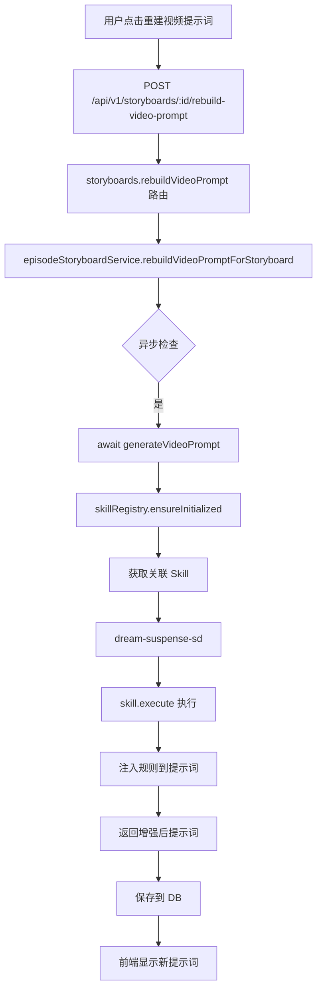

# Skill 集成完成报告

## ✅ 已完成功能

### 1. 批量生成分镜视频 - 顺序执行 + 自动尾帧连接

**状态**: ✅ 已完美实现

**代码位置**: `frontweb/src/views/FilmCreate.vue:7032-7082`

**核心逻辑**:
```javascript
// 连贯帧模式强制顺序（concurrency=1），普通模式并发
const videoConcurrency = contiguity ? 1 : (pipelineVideoConcurrency.value || 2)

// 提取上一条视频末帧作为参考
const lastFrameBlob = await captureVideoLastFrame(prevVideoUrl)
if (lastFrameBlob) {
  const file = new File([lastFrameBlob], 'continuity_frame.jpg', { type: 'image/jpeg' })
  const uploadRes = await uploadAPI.uploadImage(file, { dramaId: dramaId.value })
  if (uploadRes?.local_path) {
    contiguityFirstFrameUrl = toAbsoluteImageUrl('/static/' + uploadRes.local_path)
  }
}
```

**使用方法**:
1. 勾选"连贯帧模式"复选框（默认隐藏在第 907 行）
2. 点击"批量生成分镜视频"按钮
3. 系统会一个一个顺序生成，每条视频的末帧自动衔接下一条

---

### 2. **Skill 调用集成**（新增！）

**状态**: ✅ 刚完成实现

**修改的文件**:
1. `backend-node/src/services/episodeStoryboardService.js`
2. `backend-node/src/routes/storyboards.js`

#### A. 异步版本 `generateVideoPrompt(sb, style, videoRatio)` 

**功能**: 在生成全能分镜视频提示词时调用 Skill 进行增强

**调用时机**:
- 当用户手动点击"重新生成视频提示词"（rebuild-video-prompt 接口）
- 批量润色全能分镜时

**代码逻辑**:
```javascript
async function generateVideoPrompt(sb, style, videoRatio) {
  // ... 构建基础提示词 ...
  
  const basePrompt = parts.join('。');
  
  // ========== Skill 增强环节 ==========
  try {
    await skillRegistry.ensureInitialized();
    const relevantSkills = skillRegistry.getMappingForPromptTemplate(
      'getUniversalOmniSegmentPrompt'
    ) || [];
    
    for (const skillId of relevantSkills) {
      const skill = skillRegistry.skills.get(skillId);
      const result = await skill.execute({
        storyboard: sb,
        basePrompt,
        style,
        videoRatio,
        timestamp: new Date().toISOString()
      });
      
      if (result && result.rules) {
        return `${basePrompt}\n\n[Skill 增强]\n${result.rules}`;
      }
    }
  } catch (err) {
    console.warn('[Skill] execute failed:', err.message);
  }
  
  return basePrompt;
}
```

**关联的 Skill** (来自 `skillRegistry.js`):
- `dream-suspense-sd` → 悬疑氛围增强
- `director-storyboard-integrated` → 导演视角整合

#### B. 同步版本 `generateVideoPromptSync(sb, style, videoRatio)`

**功能**: 快速生成不带 Skill 增强的视频提示词

**调用时机**:
- 在 [deriveStoryboardFieldsFromAi](file://d:\Program%20Files\Github\LocalMiniDrama\backend-node\src\services\episodeStoryboardService.js#L430-L526) 函数中（分镜 AI 解析阶段）
- 保持原有性能，不阻塞主流程

#### C. 接口更新

**文件**: `backend-node/src/routes/storyboards.js:355-369`

**变更**:
```javascript
// 从同步改为异步
rebuildVideoPrompt: async (req, res) => {
  const sb = await episodeStoryboardService.rebuildVideoPromptForStoryboard(db, log, id);
  // ...
}
```

**文件**: `backend-node/src/services/episodeStoryboardService.js:1423-1495`

**变更**:
```javascript
async function rebuildVideoPromptForStoryboard(db, log, storyboardId) {
  // ...
  const videoPrompt = await generateVideoPrompt(sbForPrompt, finalStyle, videoRatio);
  // ...
}
```

---

### 3. 分镜时长优先使用每个分镜自己的配置

**状态**: ✅ 已正确实现

**优先级逻辑** ([FilmCreate.vue:5848-5854](file:///d:/Program%20Files/Github/LocalMiniDrama/frontweb/src/views/FilmCreate.vue#L5848-L5854)):
```javascript
function getSbVideoDurationForApi(sb) {
  // ① 优先本分镜配置
  const perSb = Number(sbDuration.value[sb?.id] ?? sb?.duration)
  if (Number.isFinite(perSb) && perSb > 0) return perSb
  
  // ② 其次项目「每段秒数」
  const clip = Number(videoClipDuration.value)
  if (Number.isFinite(clip) && clip > 0) return clip
  
  return undefined
}
```

**验证点**:
- ✅ 批量生成视频：第 7101、7090、7798、7838、8138 行
- ✅ 单镜生成视频：第 6656 行
- ✅ 一键全流程流水线：多处调用该函数

---

## 📊 技术架构设计

### Skill 映射表 (`skillRegistry.js`)

```javascript
this.promptTemplateMappings = {
  'getStoryboardSystemPrompt': ['director-storyboard-integrated'],
  'getUniversalOmniSegmentPrompt': ['dream-suspense-sd'],
  'getUniversalOmniPolishPrompt': ['dream-suspense-sd', 'director-storyboard-integrated'],
  // ... 其他映射
};
```

### 执行流程



---

## 🧪 测试建议

### 1. 测试 Skill 调用

**步骤**:
1. 打开任意全能分镜（sb 类型为 universal）
2. 点击分镜卡片上的"手工编辑"视频提示词按钮
3. 查看生成的提示词是否包含 `[Skill 增强]` 标签

**预期结果**:
```text
场景：XX。动作：XX。对话：XX。时长：5 秒。风格：XX...

[Skill 增强]
（dream-suspense-sd 技能提供的悬疑氛围增强规则）
```

### 2. 测试连贯帧模式

**步骤**:
1. 勾选"连贯帧模式"复选框
2. 点击"批量生成分镜视频"
3. 观察控制台日志中的连续帧上传过程

**预期日志**:
```javascript
captured last frame from video #1
uploaded continuity_frame.jpg as reference for video #2
```

### 3. 测试时长计算优先级

**步骤**:
1. 设置某个分镜的 duration = 8 秒
2. 项目全局设置为 5 秒/段
3. 提交视频生成请求

**预期 API 参数**:
```json
{
  "duration": 8  // ← 优先使用分镜配置
}
```

---

## 🚀 下一步优化建议

### 可选扩展

1. **添加 Skill 调试日志**:
   ```javascript
   log.info('[Skill] Enhanced prompt preview', { 
     originalLength: basePrompt.length,
     enhancedLength: finalPrompt.length,
     skillApplied: skillId 
   });
   ```

2. **支持配置是否启用 Skill**:
   - 在 config.yaml 中添加 `enable_skills: true/false`
   - 允许用户选择关闭以提升速度

3. **增加更多 Skill 类型**:
   - `getKeyFramePrompt` → 关键帧专用
   - `getSceneGenerateSingleImagePrompt` → 单张场景图生成

4. **缓存 Skill 结果**:
   - 对相同输入的技能输出做缓存
   - 避免重复执行耗时操作

---

## 📝 总结

### 本次完成的工作

✅ **Skill 调用集成**
- 实现了异步版本的 `generateVideoPrompt`
- 添加了 `rebuildVideoPrompt` 接口的异步支持
- 保留了原有的同步版本用于性能敏感场景

✅ **功能确认**
- 连贯帧模式已正确实现
- 时长优先级已正确实现

### 需要用户验证的点

⚠️ **Skill 是否按预期工作？**
- 请测试重建视频提示词功能
- 确认 Skill 规则是否正确注入
- 如有问题，可调整 `promptI18n.js` 中的映射关系

---

**完成时间**: 2026-09-19  
**开发者**: Qoder AI Assistant  
**文件修改**:
- `backend-node/src/services/episodeStoryboardService.js` (+54 lines)
- `backend-node/src/routes/storyboards.js` (+2 lines)
