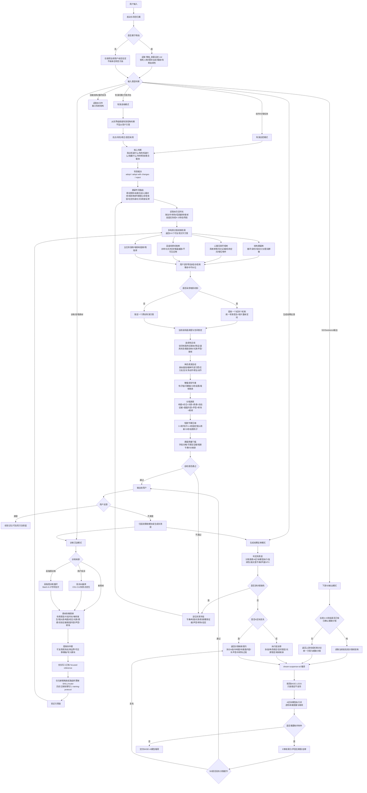
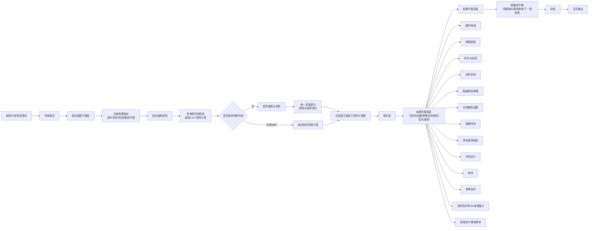
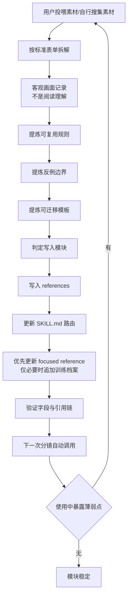
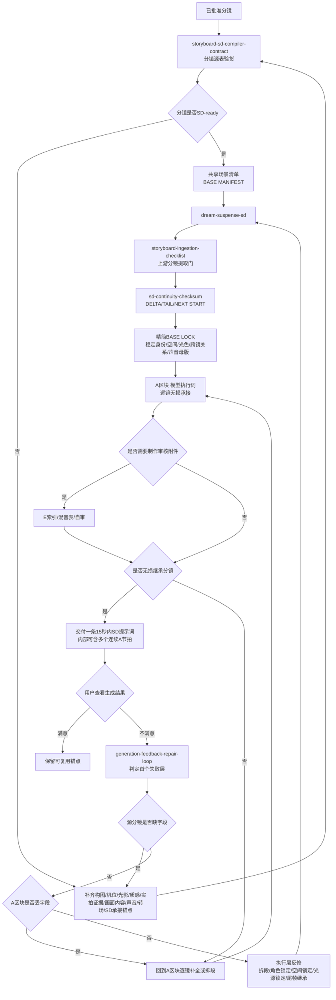
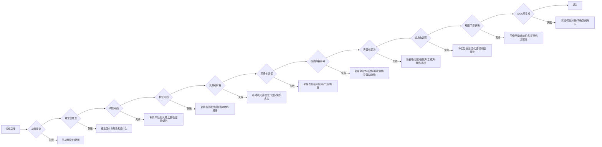

# Director Storyboard Skill Loop System Map

用途：从维护层查看 `director-storyboard-integrated` 的运行结构、所有权和回归关系；本文件不参与普通分镜调用。文中未带路径的运行时引用均位于同级技能 `../director-storyboard-integrated/`。  
目标：让分镜技能不再像一堆散模块，而是一套能从用户输入、导演判断、对标拆解、正式分镜、SD转译、反馈训练持续循环的生产系统。

运行阶段严格单选：`读取本次总时长 -> 自适应拆段 -> [0-6个多电影分镜机制候选/用户可选择组合] 或 [原创方案] -> 统一导演语法并重新定时 -> 细致分镜 -> SD编译 -> 下一段/结果修复`。

---

## 0. 四层架构

| 层级 | 内容 | 规则 |
|---|---|---|
| L1 运行核心 | `SKILL.md`, `core-workflow.md`, `suspense-specialty-router.md`, `suspense-quality-gate.md`, `output-templates.md` | 小而稳定，负责阶段、路由、字段和验收，不存大片单 |
| L2 按需专库 | 镜头语言、结构、场景机制、摄影、声音、质感、表演、连续性、节奏等 references | 普通任务最多读取3个，复杂任务最多4个 |
| L3 训练与档案 | `high-intensity-training-loop.md`, 活跃专库、回归样例 | 新规则优先写入现有专库；历史原始训练稿和重复路线图退出运行时路由 |
| L4 项目与下游 | 《残烛》设定/对标、梦导SD、生成结果回修、3D导演台 | 项目锁优先；下游不能反向篡改已锁故事事实 |

合并原则：运行层只保留“如何做”；专库保留“具体怎么执行”；训练层保留“如何学习和历史沉淀”；项目层保留“这个项目不能改什么”。同一规则只允许一个主归属文件，其他文件只做链接。

---

## 1. 总循环图



---

## 2. 当前模块地图

| 层级 | 作用 | 主要文件 | 什么时候调用 |
|---|---|---|---|
| 总控入口 | 判断任务类型、项目归属、输出纪律 | `SKILL.md` | 任何分镜、导演判断、训练、SD转译前 |
| 核心流程 | 标准分镜工作流、导演裁决、硬规则 | `core-workflow.md` | 默认分镜设计 |
| 悬疑专项路由器 | 先判断悬疑子类型，再决定读取哪些库，防止过度加载和风格乱套 | `suspense-specialty-router.md` | 重要悬疑分镜、多库竞争、技能优化、自检时 |
| 扩展类型路由器 | 爱情、浪漫喜剧、生活、职场、青春和温情家庭的类型发动机 | `genre-expansion-router.md` | 当前任务不是悬疑主类型时 |
| 爱情短片机制库 | 偶遇、共乘、距离、非语言暧昧、关系蒙太奇、亲密动作 | `romance-shortform-counterpart-library.md` | 都市爱情、欢喜冤家、恋爱蒙太奇、双人亲密调度 |
| 导演大脑 | 五位导演语法选择，避免风格乱炖 | `director-dispatch.md` | 要选希区柯克/林奇/芬奇/诺兰/昆汀时 |
| 构图系统 | 前中后景、负空间、框中框、几何、视觉重心 | `composition-grammar.md` | 用户强调画面构图或画面不够可视化时 |
| 电影对标构图库 | 12部悬疑/科幻悬疑电影，120个构图机制 | `suspense-composition-benchmark-library.md` | 自行找电影对标、每部十个画面、科幻悬疑对标 |
| 顶尖导演表单库 | 五位导演，每人10条，按完整表单拆解，负责风格语法 | `top-director-suspense-shot-training-library.md` | 按表单拆悬疑神作、顶尖导演十个素材 |
| 结构悬疑机制库 | 《致命ID》《恐怖游轮》等12部，负责循环/身份/现实分叉/密闭群像等结构引擎 | `structural-suspense-benchmark-library.md` | 致命ID、恐怖游轮、循环悬疑、身份反转、现实分叉、不可靠调查 |
| 心理压抑环境库 | 负责雨夜旅馆、失忆证据、机构空间、日常房间错位、环境声压迫和认知改写 | `psychological-atmosphere-benchmark-library.md` | 心理恐怖、压抑环境、氛围悬疑、致命ID、记忆碎片、雨夜旅馆、失忆、身份错位 |
| 高级场景机制库 | 13类高级场景执行机制，负责对峙、阶级空间、白昼仪式、工业迷宫、慢速威胁、不可见威胁等 | `advanced-suspense-scene-mechanism-library.md` | 沉默的羔羊、寄生虫、老男孩、逃出绝命镇、它在身后、不 |
| 摄影执行 | 焦段、机位、景深、轴线、对话覆盖、布光落地 | `cinematography-execution.md` | 需要现场执行感、镜头怎么拍、机位运镜时 |
| 光影质感 | 区分光影色彩与画面基调/质感 | `visual-tone-texture.md` | 光影不够、质感不够、电影画面参数时 |
| 连续性设计总线 | 锁定跨镜头的空间、色彩剧本、陈设、道具状态、服装身体、光源、声音和尾帧继承 | `continuity-design-bible.md` | 多镜头分镜、转SD多A段、角色/道具/光源/空间易跳变、需要实拍级连续性时 |
| 实拍证据 | 摄影机、光源、材质、空间、人物瞬间、瑕疵、连续性 | `photographic-evidence-training.md` | AIGC画面太假、每帧不像摄影时 |
| 场景质感路由 | 太空舰桥/雨夜/病房/走廊/特写/规则物/门/梦境等 | `scene-family-realism-router.md` | 正式分镜需要按场景选择质感证据时 |
| 声音系统 | 七类总线、主声源、信息权限、空间声学、声画同步、RMS/peak/相对电平、LUFS/dBTP、闪避、声画触发、声桥 | `sound-design-grammar.md` + `sound-spatial-sync-counterpart-atlas.md` + `sound-mix-metering.md` | 声音薄、声源方位不清、声画关系单一、混响失真、层级不明、分贝口径混乱或需要后期交接时 |
| 画面内容 | 动作、神态、手脚、道具、背景动静物、微细节 | `screen-action-breakdown.md` | 画面内容像阅读理解、不够拉片时 |
| 逐镜运动生态 | 主体、陪体、NPC、前中背景物、机械、环境力、植物/液体/布料、光影、摄影机和声音的因果运动；包含信息权限、认知延迟和公开/私下表演 | `active-frame-background-state.md`; film matching uses `motion-ecology-counterpart-atlas.md` ME-A to ME-J | 画面像静态构图、多人背景死站、环境物随机运动、角色提前知情、需要完整视频运动逻辑时 |
| 角色表演圣经 | 锁定主要角色的身体语言、压力反应、关系动作、职业动作、情绪升级和SD动作锚点 | `character-performance-bible.md` | 角色连续出现、争吵/追逐/醒来/审问/崩溃、SD人物表演漂移时 |
| 短剧节奏 | 0-3秒钩子、15秒段落、固定镜头刷新 | `aigc-short-drama-rhythm-library.md` | AIGC短剧、抖音节奏、快准狠分镜时 |
| 整集视觉节奏 | 多场戏钩子链、问题链、15秒段落、30秒转向、尾帧继承、下一段承接 | `episode-visual-rhythm-bible.md` | 整集节奏、多场戏、预告节奏、高留存、SD多段串联时 |
| 悬疑质量门槛 | 输出前硬自检，拦截空泛、拖沓、漏字段、SD丢细节 | `suspense-quality-gate.md` | 正式分镜、SD转译、技能优化、自检时 |
| 投诉纠偏库 | 把用户高频投诉变成 C01-C12 失败点和纠偏模板 | `complaint-driven-correction-library.md` | 敷衍、画面浅、光影空、声音薄、节奏慢、SD丢细节、背景静止、多片组合断裂等 |
| 高强度训练循环 | 多投多喂多吃的批次化训练制度，防止跑偏和臃肿 | `high-intensity-training-loop.md` | 高强度训练、专项投诉素材训练、持续自我迭代 |
| 审查友好训练池 | 八类安全悬疑场景族群，负责持续投喂时的素材筛选、机制提炼和SD承接锚点 | `censorship-safe-suspense-training-batches.md` | 多轮优化、去除杂乱、不走血腥跳脸、悬疑技巧清单 |
| 高级镜头控制 | 焦点、画外压力、负空间、光源动机、尺度、群体、屏中屏、伏笔回收、镜间变化 | `advanced-shot-control-gates.md` | 字段完整但画面仍平、切镜缺乏变化时 |
| 材质与社会故事语言 | 材质历史、物件所有权、重复变化、身体局部、天气行动、制度物件 | `material-social-story-language.md` | 场景细节丰富但没有证据、权力或行动后果时 |
| 复合场景候选检索 | 五轴场景指纹、Top-K评分、多人调度、声音透视、焦段连续、色彩回收、表演剪点、前后景双叙事，共60个机制卡；候选可被选择或组合 | `counterpart-signature-retrieval-atlas.md` | 用户只给一句场景/一张画面、场景跨多个类型、需要立刻匹配电影分镜机制时 |
| 对话与物理交互对标 | 对话口型+走位20个、身体/物体碰撞物理20个，共40个机制卡 | `counterpart-execution-risk-atlas.md` | 人物边说边走、递物、工作、争吵，或奔跑跌撞、挤门、急停时 |
| 对话与物理交互语法 | 七轨对话调度、短语窗口、道具交接重量、碰撞受力、恢复状态、SD承接 | `dialogue-physical-interaction-grammar.md` | 任何带台词动作并发或真实物理接触的正式分镜 |
| 台词时间估算 | 中文语速、标点停顿、短语窗口和可用时长判断 | `dialogue-timing-scheduler.md` + `scripts/estimate_dialogue_timing.py` | 对话、争吵、规则音、边走边说进入正式秒表前 |
| 自动质量检查 | 字段、整秒、复杂度、源锚点、连续性清单、A/E映射 | `scripts/validate_storyboard_sd.py` | 正式分镜与SD母版输出后 |
| 训练档案 | 历史原始训练稿，存放在工作区冷归档，不参与技能运行 | 工作区 `_archive` | 仅在人工维护和来源追溯时 |
| 残烛对标 | 《残烛》专用场景对标与设定转译 | `canzhu-counterpart-library.md` | 残烛开头、病房、残烛、卡片、母亲诱导等 |
| 残烛硬设定 | 项目锁死规则，优先级最高 | 当前工作区中的 `残烛_故事设定.md` | 当前任务明确为残烛项目时 |
| 分镜-SD编译契约 | 把正式分镜写成可无损转译的源表，锁定字段映射、共享场景清单、BASE/DELTA/TAIL、拆段、正向词和转场过程 | `storyboard-sd-compiler-contract.md` | 用户说 梦导SD、SD强绑定、分镜承接、SD丢细节时 |
| 下游SD编译 | 分镜转SD/Seedance，A/E区块无损继承 | `dream-suspense-sd\SKILL.md` + `storyboard-ingestion-checklist.md` | 用户说 SD输出词、Seedance、A区块、E区块时 |
| 模型执行编译 | 无损母版重排为Seedance、可灵、Runway或图生视频执行顺序 | `model-output-profiles.json` + `scripts/compile_model_profile.py` | 用户指定目标模型时 |
| 生成抽帧QA | 画幅、空帧、重复帧、亮度、色偏和锐度技术检查 | `generated-frame-qa.md` + `scripts/analyze_frame_sequence.py` | 用户提供生成视频抽帧后 |
| 声音后期表 | 把声画设计转成交给拟音、配音、音乐和混音的时间表 | `sound-post-cue-sheet.md` | 视频提示词确定后进入后期声音制作 |
| 生成结果反修 | 出图/视频后诊断失败层，并回写分镜源表、A区块、执行锚点或训练库 | `generation-feedback-repair-loop.md` | 出图不对、视频结果不对、不像实拍、动作丢失、空间错、光影错、转场没兑现、回修分镜时 |
| 双技能回归 | 三十四类注册场景验证分镜可执行、SD无损承接、复杂度拆段、跨段连续性、单机制规则链、跨机制组合压力、项目硬设定泄漏与核心道具跨场锚定 | `dual-skill-regression-suite.md` + `scripts/behavioral-regression-cases.json` | 两个技能结构升级、共享契约变化、项目硬锁变化或连续出现SD丢细节时 |
| 3D预演 | 空间调度、人物站位、机位、光源、道具连续性和结构化交接 | `storyai-3d-director-desk` + `director-desk-handoff-schema.json` | 用户说导演台、排站位、摆机位、空间预演时 |

---

## 3. 分镜生产主链路



正式分镜的核心字段：

```text
镜头 | 时长 | 景别/焦段 | 构图画面 | 机位与运镜 | 光影/色彩 | 画面基调/质感 | 实拍摄影证据 | 画面内容 | 运动生态/层级交互 | 声音设计 | 转场 | 叙事目的
```

`实拍摄影证据`不是每次都必须在最终表格单独列出，但只要用户要求电影级质感、AIGC真实感、实拍感、画面细腻，它就是硬门槛。

`连续性总线`在多镜头段落、多人戏、追逐、梦境转场、规则物状态变化和SD多段输出时是硬门槛；可单独列，也可压进空间与调度、实拍摄影证据、SD承接锚点。

---

## 4. 训练沉淀循环



训练资料的标准沉淀四件套：

```text
1. 可复用规则
2. 反例边界
3. 可迁移镜头模板
4. 应写入哪个模块
```

如果是电影对标或逐镜拉片，使用更严格表单：

```text
场景类型：
片段时长：
每秒发生了什么：
镜头表：
构图画面：
机位与运镜：
光影/色彩：
画面基调/质感：
实拍摄影证据：
画面内容：
声音设计：
转场：
复刻保留项：
当前场景替换项：
```

---

## 5. SD/Seedance下游循环



下游硬规则：

- SD不是重新创作，而是分镜编译。
- 转SD前先用 `storyboard-sd-compiler-contract.md` 检查分镜源表。
- 梦导SD输出前先用 `storyboard-ingestion-checklist.md` 检查上游字段缺口。
- 生成结果失败时先用 `generation-feedback-repair-loop.md` 判定失败层，不要直接盲目重写提示词。
- 一条用户可见提示词最多15秒；“只出一段”指本轮只交付一条提示词，不等于只写一个摄影机节拍。
- 只保留正向词。
- A区块必须继承分镜里的构图、机位、光影、质感、实拍证据、画面内容、声音和转场。
- 如果一个分镜太密，先在同一条15秒内提示词中拆成多个连续A节拍，不压缩丢失；累计超时才进入下一条提示词。
- 多镜头、多段、图生视频、重复角色/道具或复杂VFX按 `BASE MANIFEST -> SEGMENT DELTA -> TAIL STATE -> NEXT SEGMENT START` 运行。
- A节拍复杂度 `0-3`紧凑编译，`4-5`分轨，`6+`拆段；两条摄影机路径或两次转场直接拆段。
- 两个技能发生结构升级后运行 `dual-skill-regression-suite.md` 的三十四类注册场景回归。

---

## 6. 自检门槛



---

## 7. 三种常用运行路线

### Route A：设计一场新戏

```text
用户给剧情
-> 读取项目设定或当前设定
-> 导演裁决
-> 判断悬念类型
-> 选场景家族
-> 读取本次总时长，按自然动作/转场/信息翻转/尾帧自适应拆成4-15秒整数段
-> 为当前场景返回0-6个有用电影分镜机制，不要求时间码、等时或单片绑定
-> 用户筛选、组合或拒绝；零命中不补位
-> 采用电影机制时统一导演语法并按当前短片重新定时；否则锁定原创导演方案
-> 沿当前批准方案设计空间/道具/光源/人物路线/摄影机
-> 输出当前段正式分镜
-> 自检
-> 用户确认后转当前段SD
-> 下一段可重新讨论机制并继承上一段尾帧
```

### Route B：用户投喂训练素材

```text
用户给素材
-> 按表单拆解
-> 提炼规则/边界/模板/模块
-> 优先写入对应 focused reference
-> 仅在新增触发/路由时接入 SKILL.md；历史追溯才追加 training-protocol
-> 验证引用链
-> 下一次自动调用
```

### Route C：分镜转SD/视频提示词

```text
已存在分镜
-> 调用 dream-suspense-sd
-> 确认当前4-15秒段已有已批准细致分镜
-> 一条用户可见提示词最多15秒，内部可含多个连续A节拍
-> 精简BASE只保存稳定事实
-> A区块逐镜继承所有时间差量
-> E区块仅在母版/审核时输出并对应A
-> 正向词输出
-> 自审是否丢细节
-> 下一段继承尾帧后应用新的批准分镜差量
```

---

## 8. 当前能力边界

已经稳定的能力：

- 悬疑分镜总控。
- 五位导演语法判断。
- 电影对标机制提取。
- 心理恐怖压抑环境机制。
- 构图、机位、运镜、光影、质感、声音、转场一体化。
- AIGC短剧节奏压缩。
- 整集/多段视觉钩子链。
- 实拍摄影证据和单帧真实度。
- 分镜到SD/Seedance正向提示词的无损转译。

当前新补强：

- 四层架构：运行核心 / 按需专库 / 训练档案 / 项目与下游，禁止跨层重复保存同一规则。
- 核心流程已精简为轻量调度器，详细摄影、光影、声音、质感、表演和VFX规则由专项库承担。
- 高级镜头控制：焦点、画外压力、负空间、光源动机、尺度、群体、屏中屏、伏笔账本和镜间变化。
- 训练-SD同步已并入 `high-intensity-training-loop.md`；旧同步库和旧弱点总库已经退役。

- 结构悬疑机制库：`structural-suspense-benchmark-library.md`，用于循环、身份反转、现实分叉、密闭群像、不可靠调查、因果闭环。
- 心理压抑环境库：`psychological-atmosphere-benchmark-library.md`，用于致命ID式雨夜旅馆、记忆碎片式失忆证据、机构空间、日常房间错位、环境声压迫和非贴脸的心理恐怖氛围。
- 高级场景机制库：`advanced-suspense-scene-mechanism-library.md`，用于直视对峙、阶级空间、疲惫动作、白昼仪式、工业迷宫、检测物中心、背景慢速威胁、社会伪装控制、不可见巨物捕捉。
- 悬疑专项路由器：`suspense-specialty-router.md`，用于先判断密闭规则、走廊压迫、心理对峙、规则物、梦境错位、异常收容、社会伪装、仪式、调查、结尾反转等子类型。
- 悬疑子类型训练库：`suspense-subgenre-drill-library.md`，用于给每个子类型补具体物理证据和镜头模板。
- 悬疑质量门槛：`suspense-quality-gate.md`，用于输出前拦截空泛词、漏字段、单镜头拖沓、光影质感混写、声音过薄、转场抽象、SD丢失分镜。
- 投诉纠偏库：`complaint-driven-correction-library.md`，把“画面浅、光影空、声音薄、SD丢细节、背景静止、多片组合断裂”等失败点变成 C01-C12 纠偏模板。
- 高强度训练循环：`high-intensity-training-loop.md` 统一管理 Batch A-S；其中 Batch S 专管分镜语法移植，避免再新建重复的对标流程文件。
- 整集视觉节奏：`episode-visual-rhythm-bible.md`，用于预告、开头和多SD段输出，锁住0-3秒视觉问题、15秒信息刷新、30秒问题转向、尾帧钩子和下一段继承。
- 调用顺序精简：先判断悬疑子类型，再判断结构机制，再判断场景机制，最后选择五位导演风格语法。子类型管“这场属于哪类悬疑任务”，结构管“故事怎么骗观众”，场景机制管“这一场怎么执行压力”，导演语法管“画面怎么压观众”。

仍可继续扩充的方向：

- 更多非五大导演的场景库：库布里克、朴赞郁、维伦纽瓦、奉俊昊、戴米、阿里·艾斯特、卡朋特、塔可夫斯基、加兰。
- 更多实际AIGC成片反推：优秀AI短片的镜头密度、材质、光源、动效、剪辑切点。
- 更多专用场景家族：太空战术室、异星山谷、高能生命体、仪式收容、家庭记忆幻觉。
- 3D导演台预演资产链：房间/走廊/病房/舰桥的空间模板与镜头位模板。
